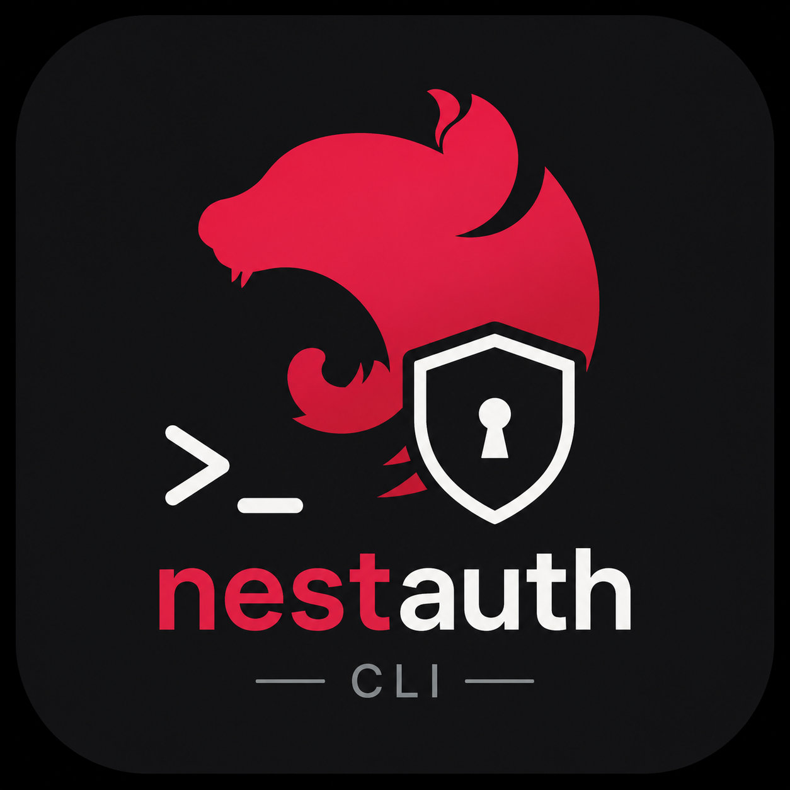

<p align="center">
  
</p>

<h1 align="center">Nest Auth CLI</h1>

<p align="center">
  <strong>Passport-free authentication boilerplate generator for NestJS.</strong>
</p>

<p align="center">
  
  
  
</p>

`nestauth` scaffolds a complete, production-ready JWT authentication system into your existing NestJS project in seconds, with no Passport dependency. All generated code is yours to read, extend, and own.

---

## Usage

### Option A - Global install (recommended)

Install once, then use `nestauth` as a regular command anywhere:

```bash
npm install -g @takiy/nestauth
```

```bash
nestauth init
nestauth add google
nestauth guard admin
```

### Option B - npx (no install required)

Run directly without installing. Prefix every command with `npx @takiy/nestauth`:

```bash
npx @takiy/nestauth init
npx @takiy/nestauth add google
npx @takiy/nestauth guard admin
```

---

## Quick Start

**1. Initialize the auth structure**

```bash
nestauth init
```

Prompts you for sign-in methods, route prefix, refresh tokens, and more, then generates the full `src/auth/` folder, wires `AuthModule` into your `AppModule`, and installs required packages.

**2. Add a login provider to an existing project**

```bash
nestauth add email
nestauth add google
```

Generates the provider and DTO, then wires them into `auth.module.ts`, `auth.service.ts`, and `auth.controller.ts` automatically.

**3. Generate a custom authorization guard**

```bash
nestauth guard <name>
```

Generates a custom guard, eg: `admin.guard.ts`, adds `AuthType.Admin` to the enum, and wires the guard into `AuthenticationGuard` and `auth.module.ts` with no manual wiring needed.

---

## What Gets Generated

<details>
<summary>Full <code>src/auth/</code> structure after <code>nestauth init</code></summary>

```
src/auth/
├── auth.module.ts
├── auth.controller.ts
├── auth.service.ts
├── config/
│   ├── auth.config.ts
│   └── google-auth.config.ts       (if Google selected)
├── guards/
│   ├── access-token.guard.ts
│   └── authentication.guard.ts
├── decorators/
│   ├── auth.decorator.ts
│   └── current-user.decorator.ts   (optional)
├── interfaces/
│   └── token-payload.interface.ts
├── enums/
│   └── auth-type.enum.ts
├── providers/
│   ├── jwt-token.provider.ts
│   ├── email-auth.provider.ts      (if Email / Password selected)
│   ├── google-auth.provider.ts     (if Google selected)
│   └── refresh-token.provider.ts   (if refresh tokens enabled)
└── dto/
    ├── email-password.dto.ts       (if Email / Password selected)
    ├── google-login.dto.ts         (if Google selected)
    └── refresh-token.dto.ts        (if refresh tokens enabled)
```

</details>

---

## Guard Architecture

All routes are protected by a global `AuthenticationGuard` (`APP_GUARD`). It reads the `@Auth()` decorator on each route and dispatches to the appropriate guard via an internal map.

```
AuthenticationGuard  (global APP_GUARD)
        │
        ├──► AccessTokenGuard     @Auth(AuthType.Bearer)
        ├──► AdminGuard           @Auth(AuthType.Admin)    ← nestauth guard admin
        └──► (none)               @Auth(AuthType.None)
```

`AccessTokenGuard` extracts the Bearer token from the `Authorization` header, verifies it with `JwtService.verifyAsync()`, and attaches the decoded payload to `request.user`.

All login providers (`EmailAuthProvider`, `GoogleAuthProvider`, `RefreshTokenProvider`) delegate token generation to a single `JwtTokenProvider`, which always returns `{ accessToken, refreshToken }`.

---

## Controlling Access

```ts
import { Auth } from './auth/decorators/auth.decorator';
import { AuthType } from './auth/enums/auth-type.enum';

// Requires a valid Bearer JWT
@Auth(AuthType.Bearer)
@Get('/profile')
getProfile() {}

// Public — no authentication required
@Auth(AuthType.None)
@Post('/login')
login(@Body() dto: EmailPasswordDto) {}

// Multiple guards — any one must pass
@Auth(AuthType.Bearer, AuthType.Admin)
@Get('/dashboard')
dashboard() {}
```

---

## Environment Variables

`nestauth init` appends only the keys your project needs to your `.env` file (existing keys are never duplicated):

```env
JWT_ACCESS_SECRET=
JWT_ACCESS_EXPIRATION=3600

JWT_REFRESH_SECRET=        # if refresh tokens enabled
JWT_REFRESH_EXPIRATION=604800

GOOGLE_CLIENT_ID=          # if Google provider added
```

---

## Extending Authentication

| Need                             | Command                                      |
| -------------------------------- | -------------------------------------------- |
| Add a new login method           | `nestauth add email` / `nestauth add google` |
| Add a custom authorization guard | `nestauth guard <name>`                      |

---

## Contributing

See [`src/README.md`](src/README.md) for the CLI source structure and how each part works.

---

## License

ISC
